# 实验1：裁剪多边形

软件03 陈启乾 2020012385

## 编译环境和编译方式

采用 Typescript 语言开发，需要配置 Node.js 开发环境。

1. 安装 Node.js 环境

2. 在项目根目录下运行 `npm install`

3. 在项目根目录下运行 `npm run build`

4. 在浏览器中打开 `/dist/index.html`

以上流程已经完成，`dist` 文件夹已经在压缩文件中提交。

本实例亦部署于 (https://blog.cqqqwq.com/webgl/hw1/)，但不保证与提交内容一致。

## 交互方式

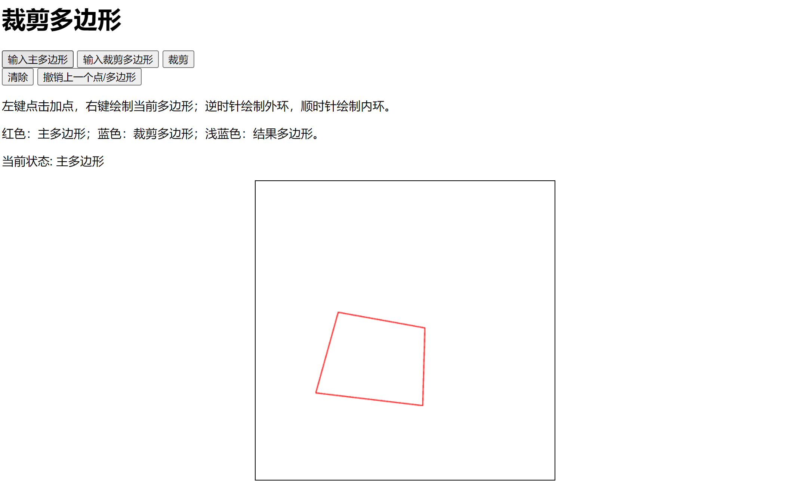

默认情况下是输入主多边形。

在黑框内画布左键点击可以给多边形加入一个新点，右键点击闭合当前绘制的多边形。支持多个多边形，但需注意，外环需要**逆时针**输入，内环需要**顺时针**输入。

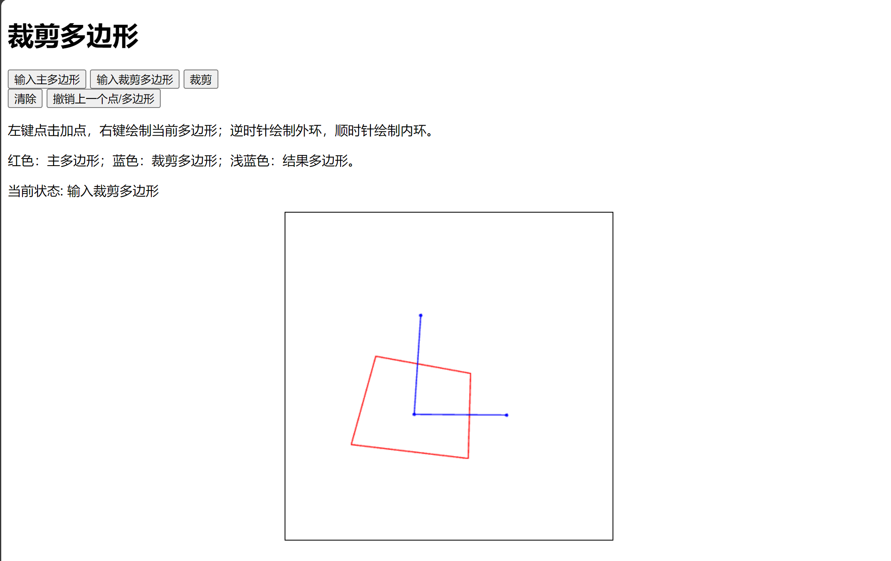

点击“裁剪”后会执行裁剪算法。

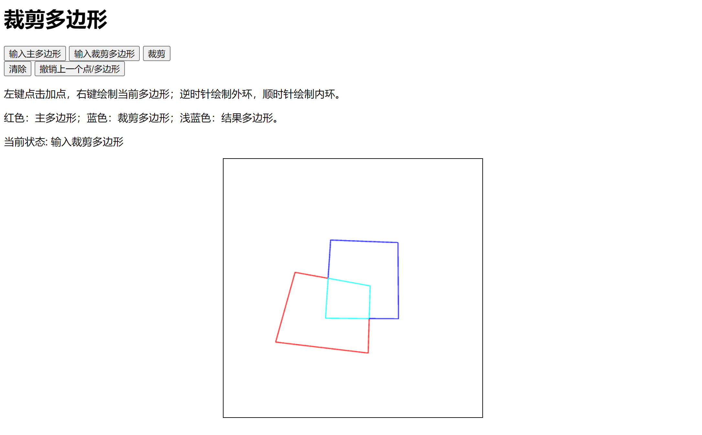

此时浅蓝色的部分即为得到的裁剪后的多边形。

可以点击清空按钮清空整个画布

## 实验目的

进行多边形裁剪。

## 方法

### 绘图

使用 WebGL 框架，在 HTML5 中的 `canvas` 对象上，进行点/线的绘制。

### 数据结构

定义 `Point` 类存储一个点，包括 `x` 坐标和 `y` 坐标。

定义 `Loop` 类存储一个环，包括若干个点。（外环以逆时针顺序存储，内环以顺时针顺序存储）。

定义 `Polygon` 类存储一个多边形，包括若干个环（内环或外环）。

### 线段求交

线段求交采用叉积判断。如果线段 2 的两个点对线段 1 的叉积符号相反，说明线段 2 的两个点在直线 1 的两侧。同理我们可以发现线段 1 的两个点是否在直线 2 的两侧。如果以上两个条件全都满足，那么线段 2 和 线段 1 就有交点。

我们可以通过叉积算出来的面积的比例算出交点的位置。

### 多边形求交

多边形求交采用 WA 算法。

1. 对于主多边形和裁剪多边形里面所有的环，我们两两之间求交集，对每个环维护一个点的数组，以顺时针（内环）或逆时针（外环）存储这个环本身的点和所有和其他环的交点。

2. 我们每次找出一个还没有遍历的交点，然后从这个点开始生成环。

    + 对于交点，我们会判断是往主多边形走，还是往裁剪多边形走更加“在多边形内侧”（前进方向右侧），这是通过叉积的正负性决定。我们会选择更“内测”的点作为下一个点。
    + 对于顶点，我们会直接选择环对应的数组的下一个点。
    + 维护交点是否已经被遍历过。
    + 直到走到已经遍历过的点。

3. 直到所有交点都被遍历过，我们就可以根据生成的环绘制

## 实验结果

### 平凡情况

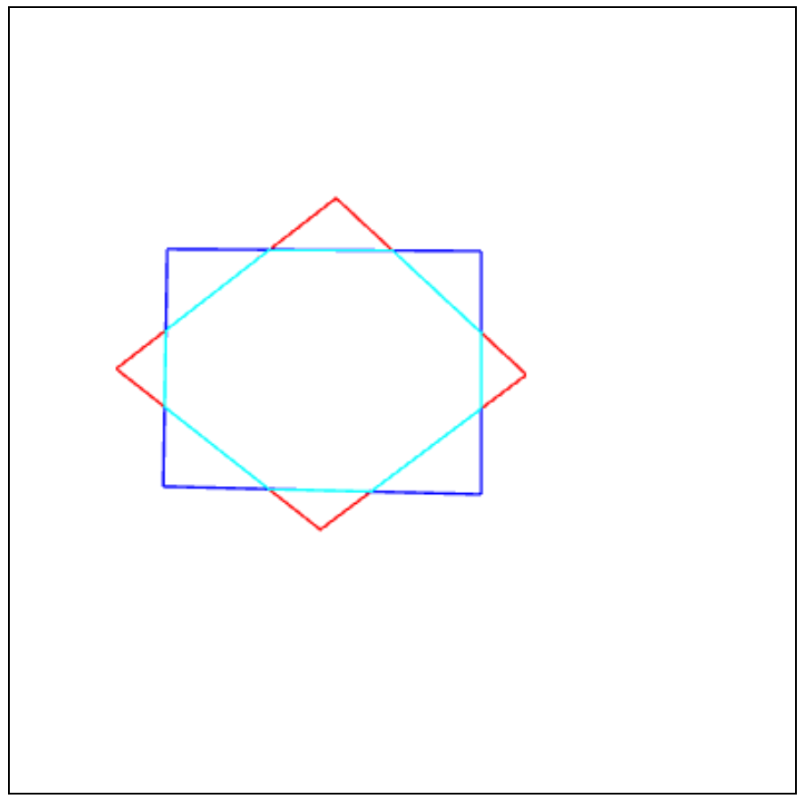

### 裁剪多边形有内环

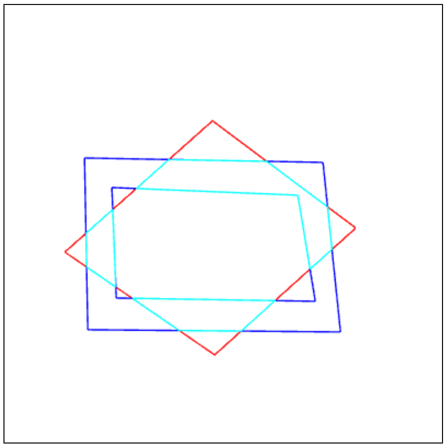

### 主多边形有内环

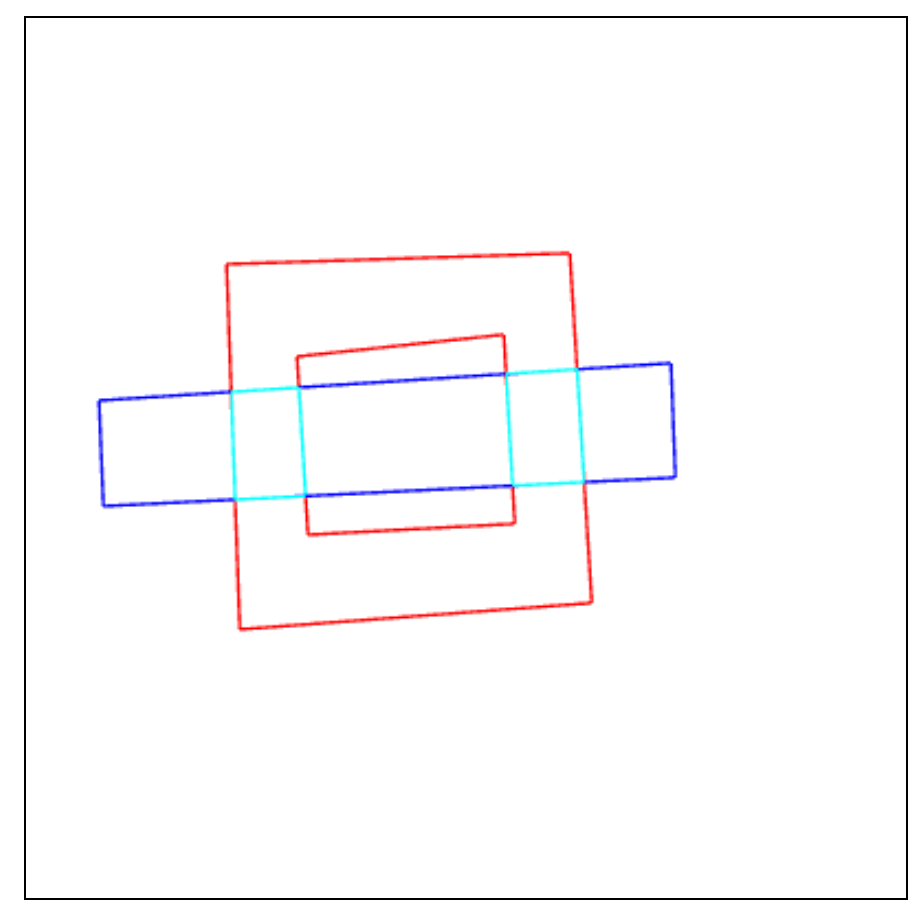

### 两个多边形都有内环

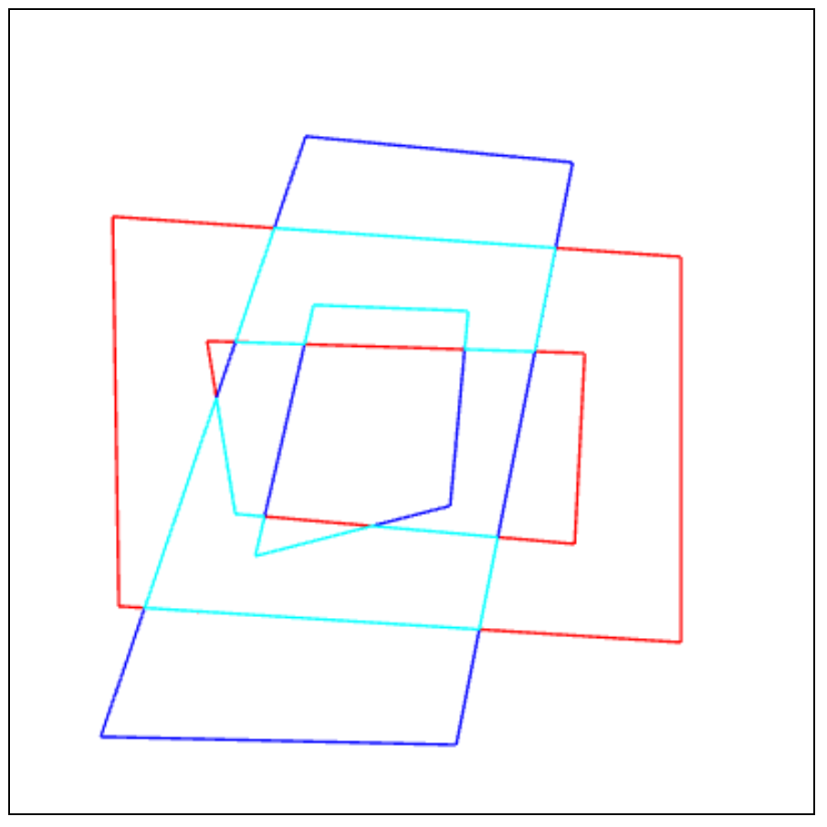

### 凹多边形

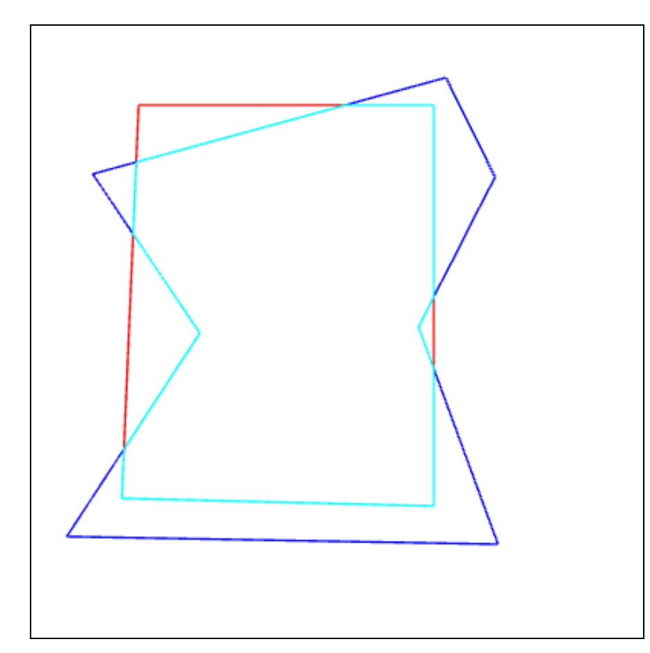

### 多个内环

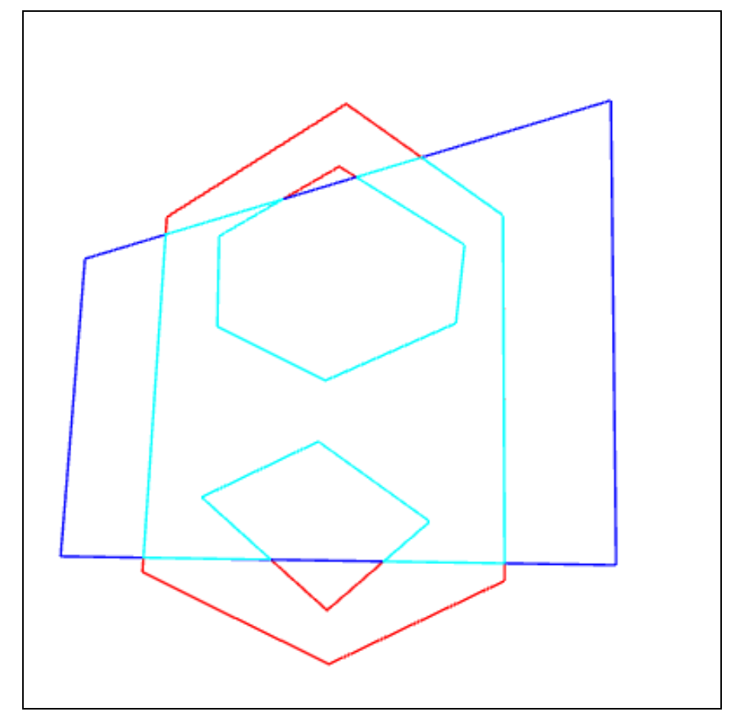

### 无交点

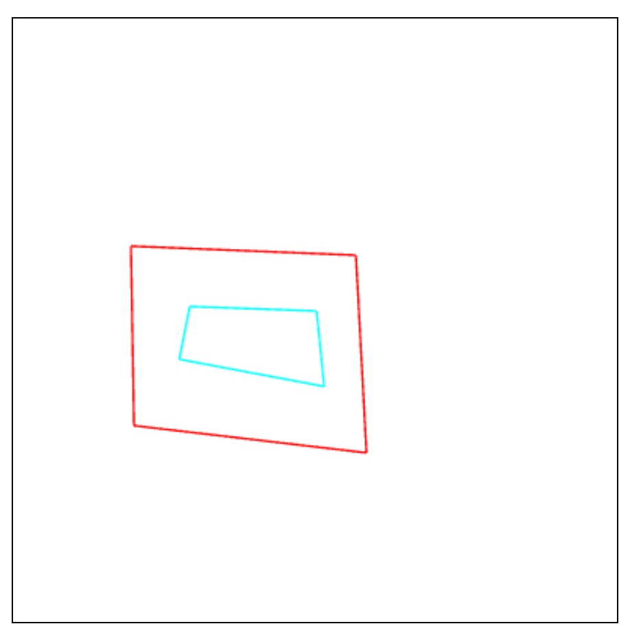

### 多个外环

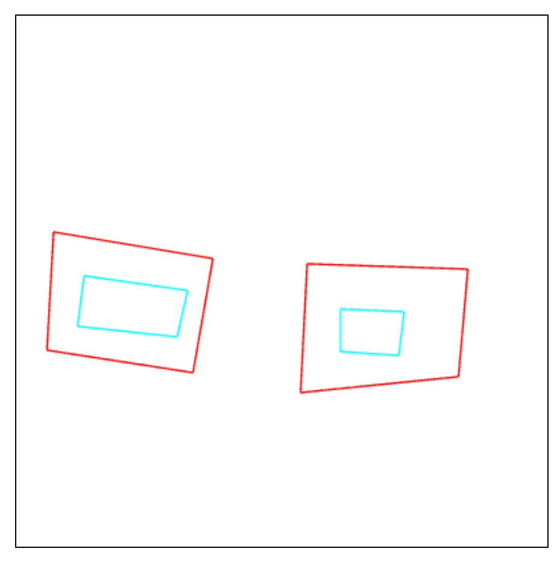

### 套来套去

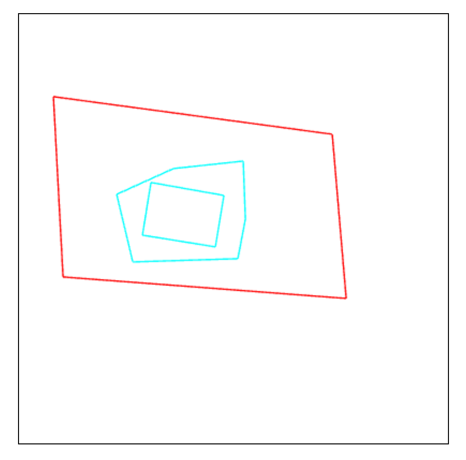