# 实验2：场景绘制

软件03 陈启乾 2020012385

## 编译环境和编译方式

采用 Typescript 语言开发，需要配置 Node.js 开发环境。

1. 安装 Node.js 环境

2. 在项目根目录下运行 `npm install`

3. 在项目根目录下运行 `npm run start`

4. 根据命令行提示，在浏览器中打开如 `http://localhost:8080` 的网页

5. 点击 "作业2"

本实例亦部署于 (https://blog.cqqqwq.com/webgl/hw2.html)，但不保证与提交内容一致。

## 作业实现

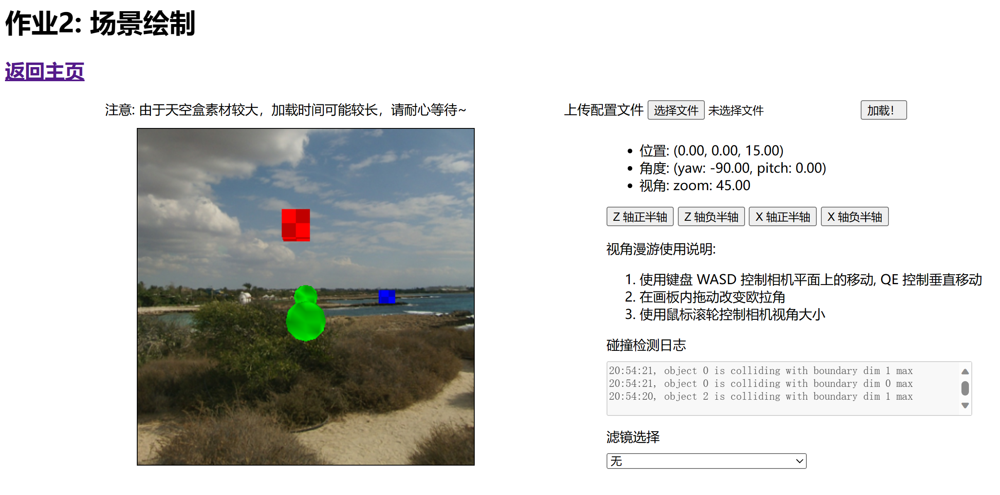

### 场景构建

> 构建一个简单场景（如秀丽山河、画廊、海底世界等），利用天空盒构建场景的背景。 

> 场景中至少包含2个静态3D物体和1个动态3D物体，物体无需纹理贴图，纯色即可。自行设计动态物体的运动路线，随机的和固定的路线均可，无需考虑物理规律。

上图右侧画布即为我们构建的场景。

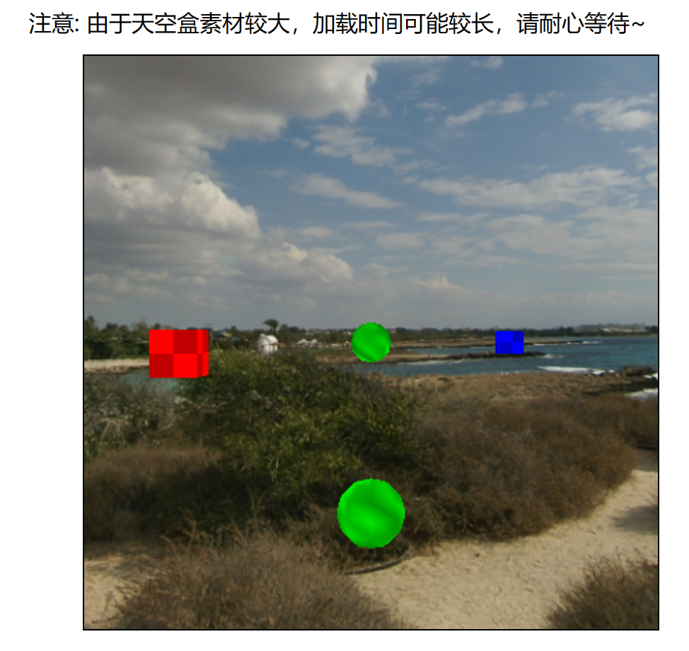

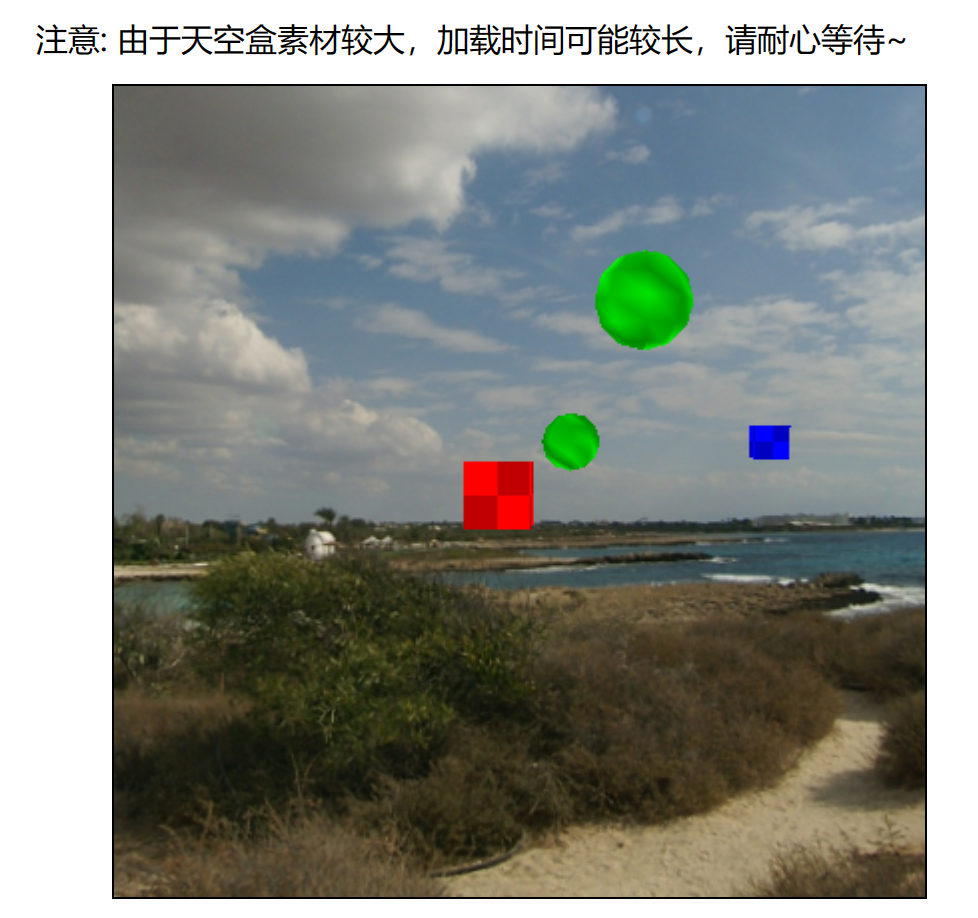

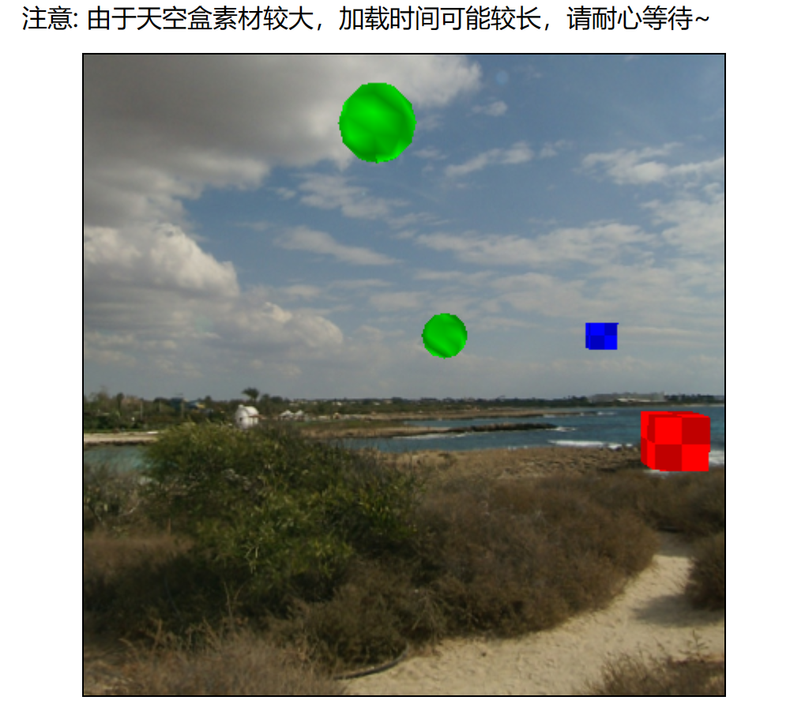

> 程序支持场景文件（自定义文件格式）的读入，可通过场景文件编辑场景，如修改物体初始位置、颜色等。

在场景右上角：

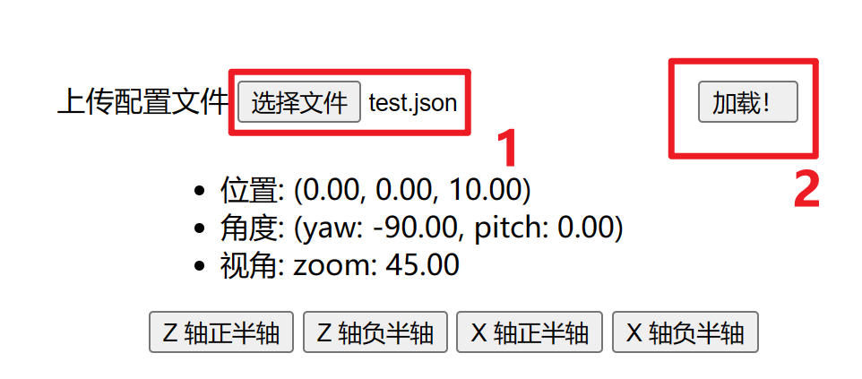

需以 Json 文件输入，大致格式为：

```typescript
interface ObjectData {
    type: string;
    position: number[]; // vec3
    speed: number[]; // vec3
    size: number;
    isMovable: boolean;
    color: number[]; // vec3
}

interface BoundaryData {
    x: number[]; // vec2
    y: number[]; // vec2
    z: number[]; // vec2
}

interface CameraData {
    position: number[]; // vec3
    angle: number[]; // yaw + pitch
    zoom: number;
}

interface ConfigData {
    objects: ObjectData[];
    boundary: BoundaryData;
    camera: CameraData;
}
```

样例（`test.json`）：

```json
{
    "objects": [
        {
            "type": "cube",
            "position": [-3, 0, 0],
            "speed": [1.5, 0, 0],
            "size": 1,
            "isMovable": true,
            "color": [0.5, 0.5, 0]
        },
        {
            "type": "ball",
            "position": [3, 0, 0],
            "speed": [-2, 0, 0],
            "size": 2,
            "isMovable": true,
            "color": [1, 0, 1]
        },
        {
            "type": "cube",
            "position": [0, 0, 0],
            "speed": [0, 0, 0],
            "size": 0.5,
            "isMovable": false,
            "color": [1, 0, 0]
        }
    ],
    "boundary": {
        "x": [-5, 5],
        "y": [-5, 5],
        "z": [-5, 5]
    }, 
    "camera": {
        "position": [0, 0, 10],
        "angle": [-90, 0],
        "zoom": 45
    }
}
```

效果：

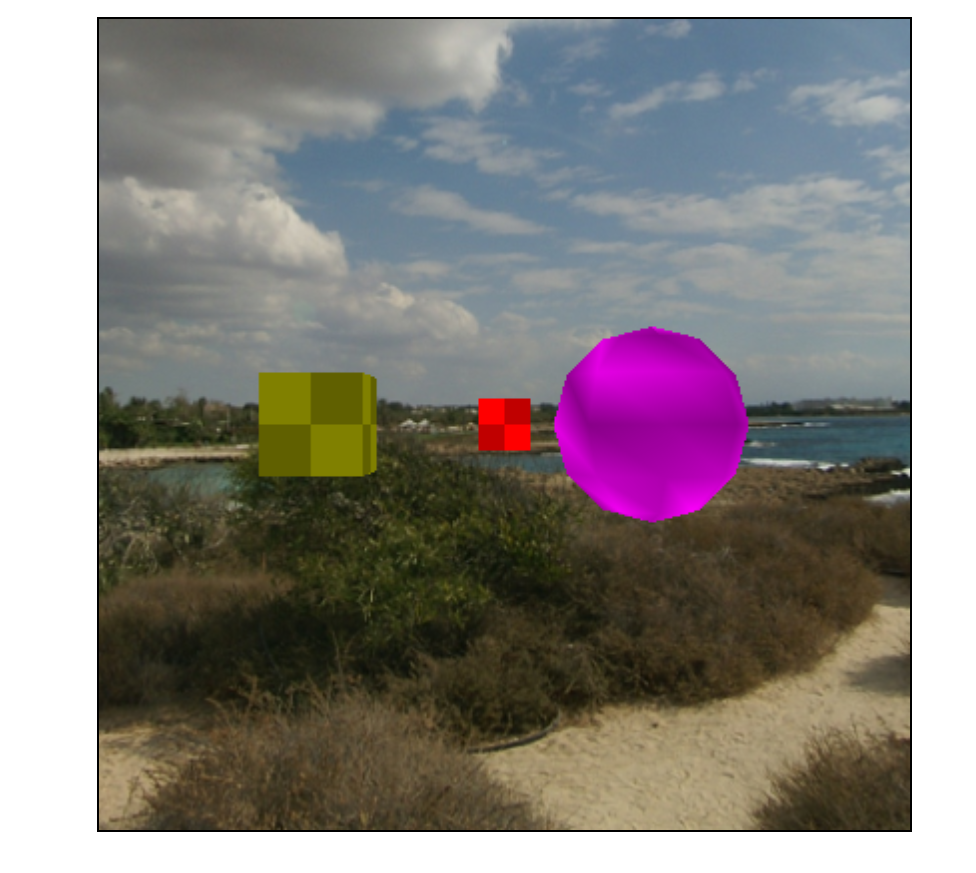

### 场景漫游

> 自行设计交互方式，实现相机位置、视线方向的改变。

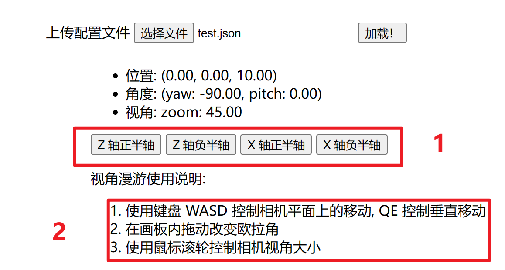

1 处提供了四个按钮，可以进行快捷的调节。也可以通过键盘鼠标的方式来快速调节。

### 碰撞检测 

> 使用 AABB 碰撞检测算法实现物体与物体之间的碰撞检测。

> 当发生碰撞时在UI界面给出提示，物体不可穿过物体。

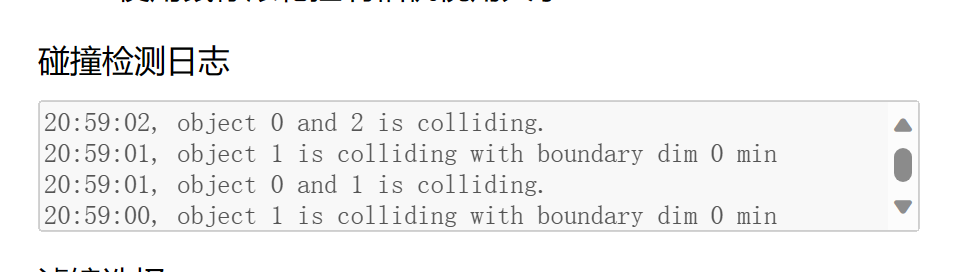

碰撞日志会按照时间倒序输出物体和边界、物体和物体的碰撞提示。碰撞后，两者会交换速度。


### 滤镜

> 利用帧缓冲实现一个滤镜，如反相、灰度、核效果等。


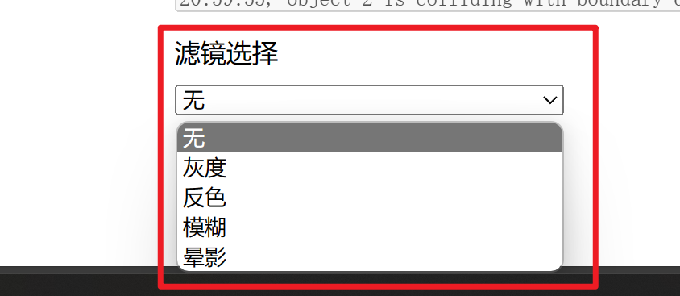

在界面右下角，提供了五种滤镜可供选择。

效果：

1. 正常

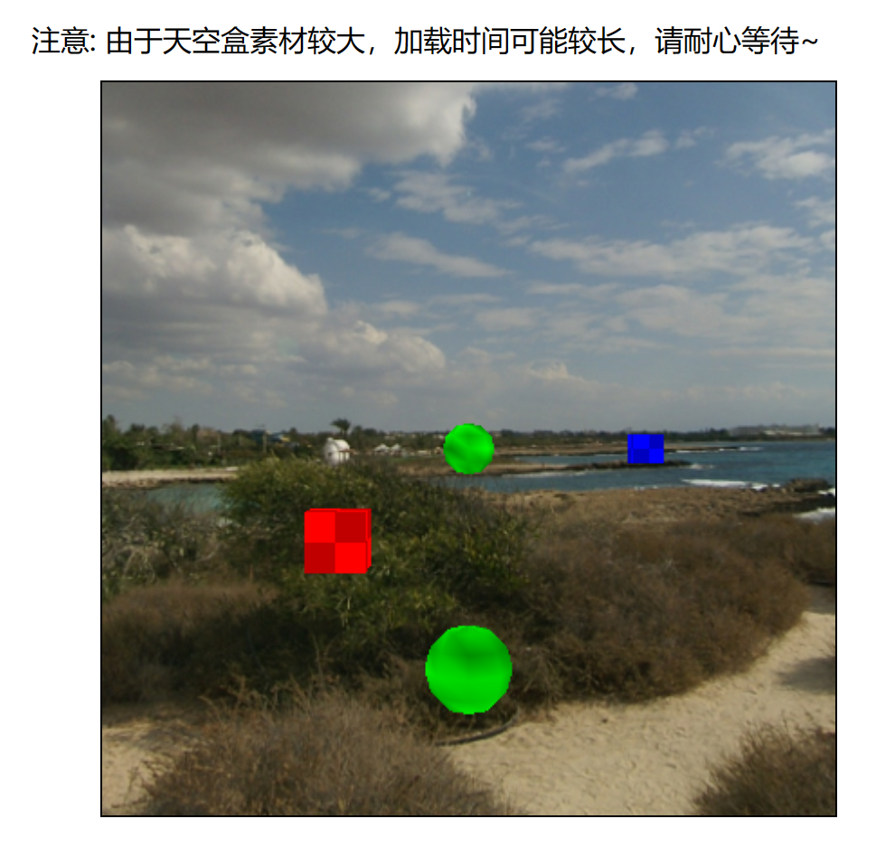

2. 灰度

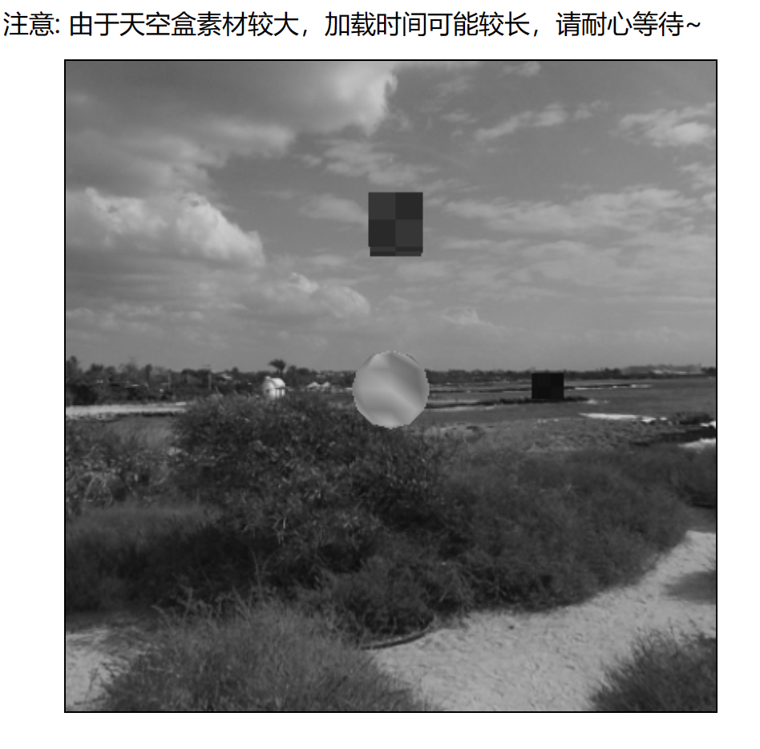

3. 反相

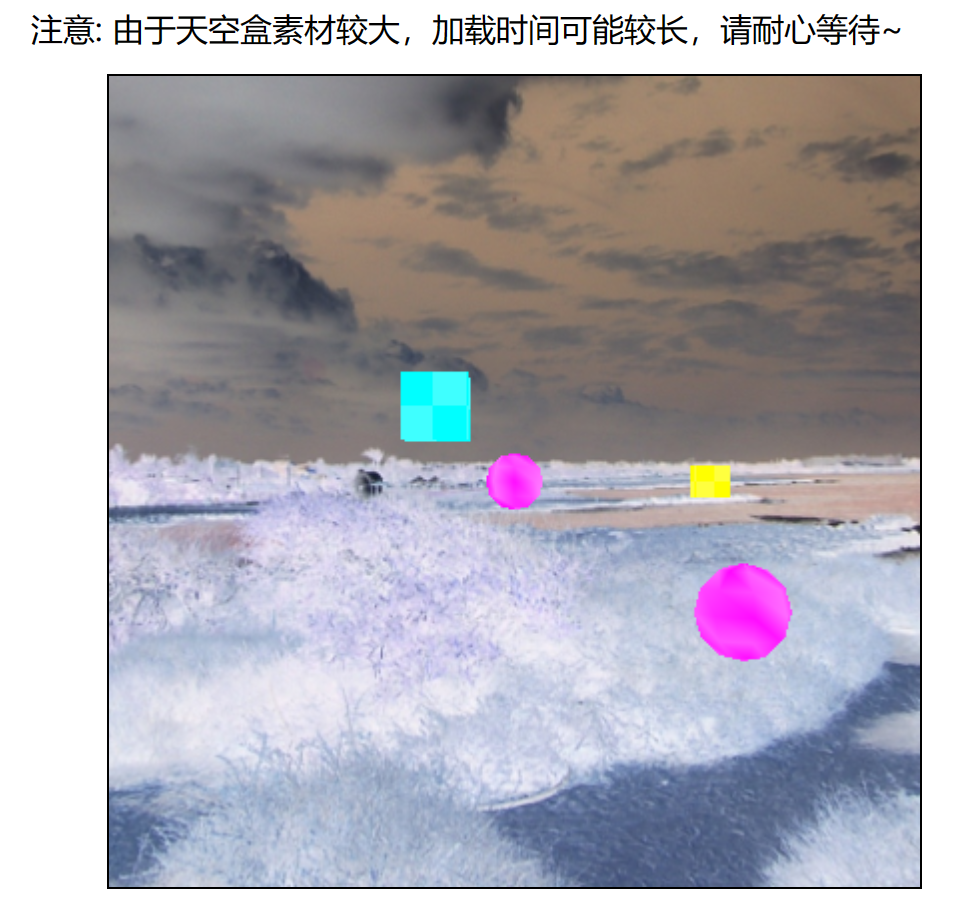

4. 模糊

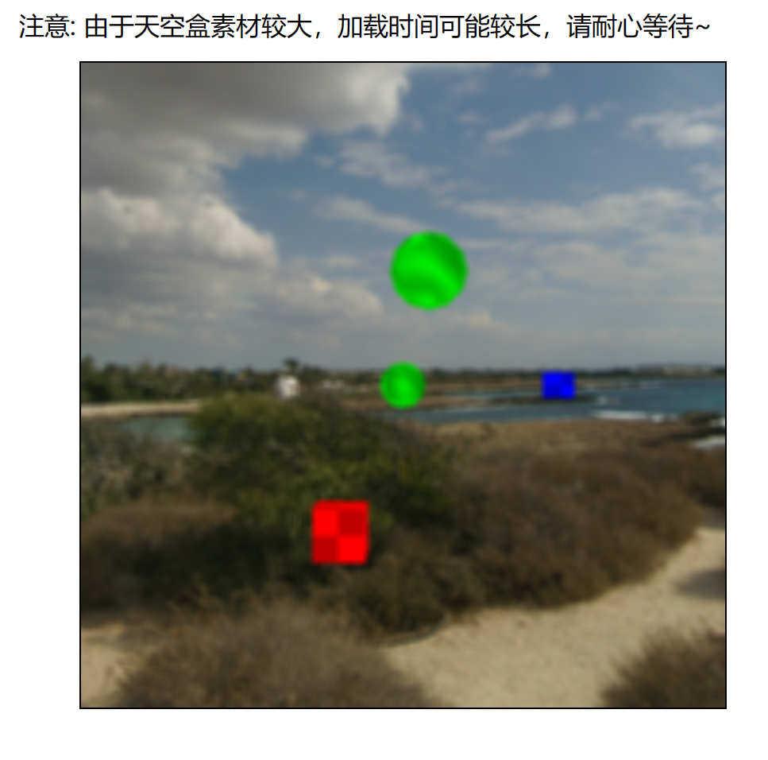

5. 晕影

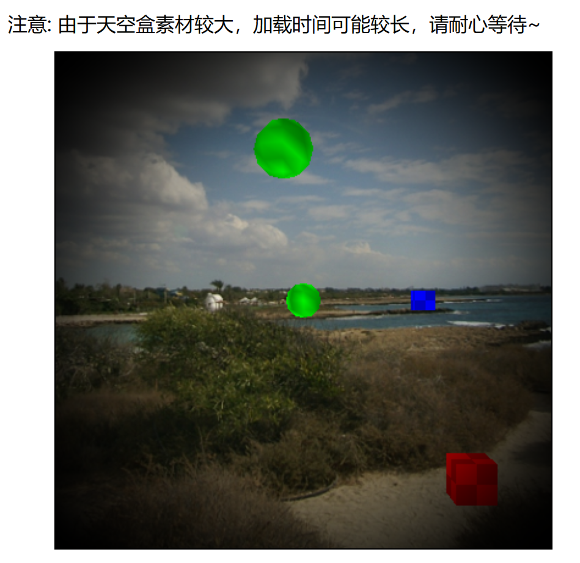


