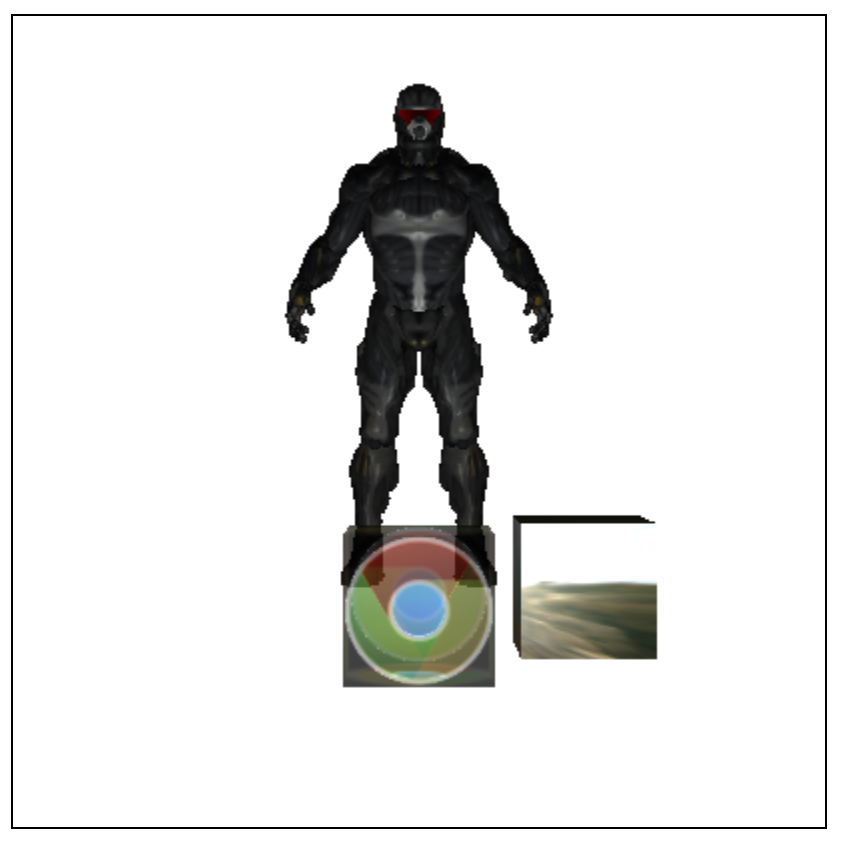

# 作业3：真实渲染

## 光照效果实现

光照效果和透明效果都采用 Shader 实现。Phong 光照模型分为三个部分：环境光、漫反射光和镜面光。最终得到一个综合的光强度 $I$, 将 $I$ 与物体的颜色相乘，透明度保持不变，得到最终的颜色。

1. 环境光：对光强度的贡献是一个常数，这里设置为 0.2

2. 漫反射光：对光强度的贡献是光线方向单位向量和法向量的点积

3. 镜面光：对光强度的贡献是反射方向单位向量和视线方向单位向量的点积的 $n$ 次方，这里 $n$ 设置为 20

## 透明效果实现

透明效果采用了 OIT 的实现。

1. 渲染不透明的物体和不参与 OIT 的物体到某个纹理中，这里打开深度测试，并且更新深度
2. 渲染透明物体，这里使用一个特殊的 vertex shader 和 fragment shader，将结果根据 Weighted Blended 的方法，分别将累计的颜色和累计的透明度渲染到两个纹理中。这一步需要使用深度测试，但是不更新深度
3. 渲染不透明的物体和不参与 OIT 的物体到屏幕上，这里关闭深度测试
4. 根据累计的颜色和累计的透明度，将参与 OIT 的物体渲染到屏幕上

## 镜面效果实现

镜面效果在光栅化中使用环境映射实现.

## 场景效果实现

1. 可以修改物体的位置
2. 可以指定物体的材质（是否从文件读入，颜色等）
3. 可以指定物体的光照效果（透明、镜面等）

## 加载 3D 模型实现

3D 模型的加载使用 Three.js 3D 图形渲染库，使用 .obj 和 .mtl 格式传输格式文件。文件被加载后会成为 Three.js 的 Mesh 对象，经过一些处理之后成为 Vertex Array Object 并且加入到场景中。

贴图进行了两个部分：

1. 漫反射贴图：即正常的贴图
2. 镜面反射贴图：决定反射光的颜色
3. bump贴图: 对法向量进行修改, 带来凹凸不平

## 光线追踪

从摄像头的位置，在每个像素的位置射出射线。

处理光线的流程如下：

1. 光线将与所有的面片求交，求交的结果中，距离摄像头最近的面片将被选中。

2. 处理如下几部分光照：

    1. 全局光照：全局光照系数 * 漫反射纹理的颜色
    2. 漫反射光照：光线方向和法向量的点积 * 漫反射纹理的颜色
    3. 反射得到的光照：递归追踪，将得到的光线方向和反射系数 * 反射纹理的颜色（默认为纯白） * 
    4. 透射得到的光照

3. 反射和投射光线的光强都会衰减，衰减系数为 0.5

结果:

